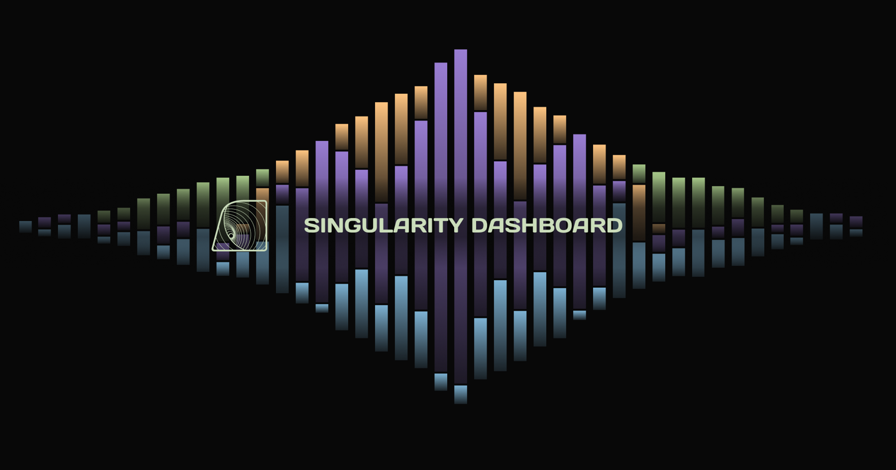

# Singularity metrics dashboard

This repo contains a frontend dashboard for metrics on Singularity.

## Stack

- This is a [Next js](https://nextjs.org/) project made in Typescript
- A serverless function facilitates communication with the database
- Both the site and the serverless function are deployed via Vercel

## Local development

- This site has been tested on `node 16.14.0`
- After cloning the repo, you'll need to create a `.env` file with the Mongo connection string `MONGODB_URI=mongodb+srv://.../?readPreference=secondaryPreferred`
- After that, install dependencies: `npm ci`
- And finally, run the app in dev mode `npm run dev`
- Open [http://localhost:3000](http://localhost:3000) with your browser to see the result

## Deployment

Currently this project is deployed on the [Vercel Platform](https://vercel.com/new). This handles the following functionality:

- Deployment, including shipping to production
- Build previews
- Backend/Serverless functions

To deploy to production or via CI:

- Use the following docker container `node:16.14.0`
- Run `npm ci && npm run build && npm run start`
- Serve the `/out` directory, which will contain the static frontend

Production deployment happens automatically as long as builds pass and production PRs are made against the `main` branch.

Check out the [Next.js deployment documentation](https://nextjs.org/docs/deployment) for more details.
